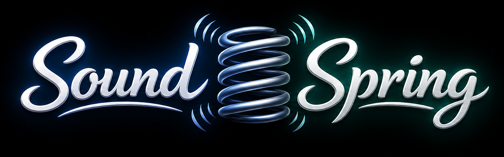
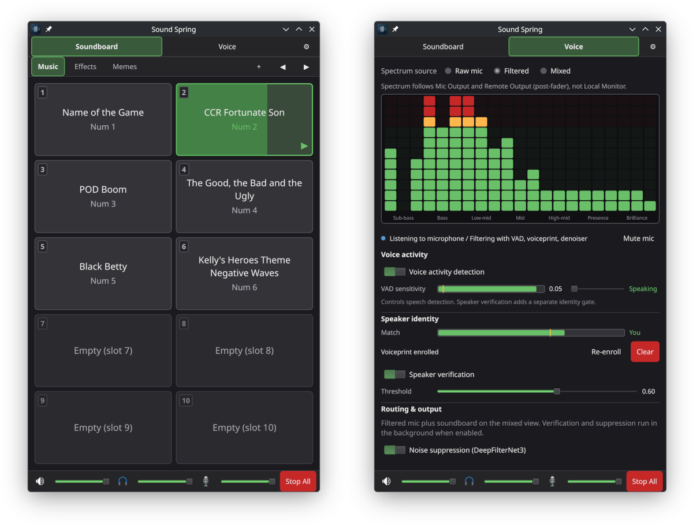

# 



A PipeWire-routed soundboard with tab-cycling hotkeys, designed for KDE Plasma on Wayland (CachyOS and similar distros).

Sounds play through a dedicated virtual sink and are mixed with your real microphone into a single **virtual microphone** that Discord, Zoom, and OBS can capture.

## Quick start

**Requirements:** PipeWire (with Pulse compatibility), `paplay`, Qt 6 runtime libraries, and optionally `ffmpeg` for MP3.

### Build and install

```bash
# Build dependencies (Debian/Ubuntu example):
#   rustup, qt6-base-dev, qt6-declarative-dev, pkg-config, libpulse-dev

QMAKE=/usr/bin/qmake6 make build
sudo make install PREFIX=/usr/local   # installs sound-spring + .desktop entry
gtk-launch sound-spring
```

The first `cargo build` downloads the ECAPA speaker model (~80 MB) into `assets/models/` and embeds it in the binary. Offline builds can place that file manually and set `SOUND_SPRING_SKIP_MODEL_DOWNLOAD=1`.

### First launch

1. Open **Settings** (gear icon) and pick your hardware microphone under Audio.
2. Add audio files to tab folders under `~/.config/soundboard/tabs/` (starter folders `01-Memes`, `02-Music`, `03-Effects` are created automatically on first install when `tabs/` has no subfolders).
3. Open **Settings → Shortcuts** and click **Apply** to register global hotkeys via the desktop portal.

In Discord/OBS, set **Microphone** to **Sound-Spring-Virtual-Microphone**.

## Directory layout

```
~/.config/soundboard/
├── config.toml              # mic, paths, voice settings, shortcuts
├── tabs/                    # default tabs root (subfolder per tab)
│   ├── 01-Memes/
│   ├── 02-Music/
│   └── 03-Effects/
└── voiceprints/             # enrolled speaker profile (when using Voice panel)

~/.cache/soundboard/
└── state.json               # current tab path
```

Number-prefix files so lexical sort maps to slots 1–10. Tab folder names are for display and order only.

Supported audio formats: **OGG**, **WAV**, **FLAC**, **MP3**, plus Opus/M4A/AAC. WAV and OGG play via `paplay`; MP3 uses `ffmpeg` piped to `paplay` when available.

### Custom tab folders

By default, each subdirectory under `tabs_root` is a tab. To use folders anywhere on disk, add them to `config.toml`:

```toml
[paths]
tabs_root = "/home/you/.config/soundboard/tabs"
state_dir = "/home/you/.cache/soundboard"

[[tabs]]
path = "/home/you/Music/memes"
name = "Memes"
```

When any `[[tabs]]` entries exist, only those folders are used (scan mode is disabled).

## Hotkeys

In-window numpad keys work immediately. Global shortcuts use **xdg-desktop-portal** — open **Settings → Shortcuts** and click **Apply** to bind them with KDE. You may see a permission dialog the first time.

Default bindings (configurable in Settings):

| Action              | Default       |
| ------------------- | ------------- |
| Play slots 1–10     | Numpad 1–9, 0 |
| Next / previous tab | Numpad + / −  |
| Stop all            | Num .         |

## PipeWire routing

The app creates virtual sinks, loopbacks, and a remapped virtual microphone on launch (and when audio settings change):

| Device name                         | Type               | Purpose                              |
| ----------------------------------- | ------------------ | ------------------------------------ |
| **Sound-Spring-Virtual-Microphone** | Microphone (input) | Select this in Discord/OBS           |
| **Sound-Spring-Effects**            | Speaker (output)   | Internal playback sink               |
| **Sound-Spring-Mix**                | Speaker (output)   | Internal mix bus — do not use as mic |

Enable **Launch at login** in Settings to re-apply routing after reboot. If PipeWire is restarted while the app is running, playback automatically re-creates missing sinks.

## Development build

```bash
source "$HOME/.cargo/env"
QMAKE=/usr/bin/qmake6 cargo build --release
ls -lh target/release/sound-spring   # ~55–60 MB stripped (includes embedded ECAPA model)
RUST_LOG=sound_spring=info ./target/release/sound-spring
```

On first launch, the log line `startup: first frame in N ms` reports time from process start to main-window `Component.onCompleted`.

### Testing global shortcuts — must run outside Cursor / Electron / Chromium

`xdg-desktop-portal` identifies the calling application by walking the caller's systemd cgroup scope. Launch via the app menu, KRunner, or `gtk-launch sound-spring` — not from a terminal embedded inside Cursor, VS Code, or Chromium.

See [docs/global-shortcuts.md](docs/global-shortcuts.md) for the full diagnostic protocol.

## Packaging

- **Distro packages:** `make install DESTDIR=... PREFIX=/usr`
- **Flatpak:** see [`packaging/flatpak/io.github.benwhite1987.SoundSpring.yml`](packaging/flatpak/io.github.benwhite1987.SoundSpring.yml)
- **AppImage:** install into an AppDir with the same `make install PREFIX=/usr` pattern

Host dependencies (PipeWire, `paplay`, optional `ffmpeg`) are not bundled in the binary.

## See also

- [PROJECT.md](PROJECT.md) — architecture overview
- [SOUNDBOARD_SPEC.md](SOUNDBOARD_SPEC.md) — soundboard specification
- [SOUNDBOARD_SPEC_PHASE2.md](SOUNDBOARD_SPEC_PHASE2.md) — Voice enhancement panel
- [THIRD_PARTY_NOTICES.md](THIRD_PARTY_NOTICES.md) — bundled ML models and licenses
